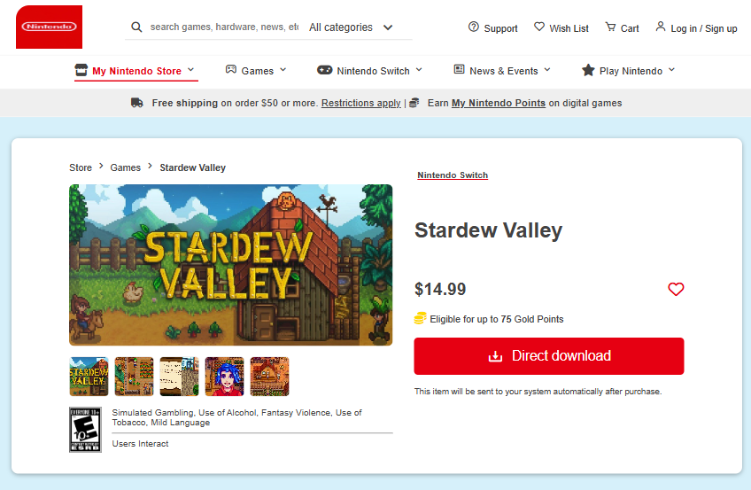

# 🎮 Nintendo-Store

A responsive replica of the official Nintendo Store website, built with HTML an CSS.

This project was created for learning purposes and as a practice to improve frontend development skills.

# ✨ Features

🖥️ Responsive Design – Works on desktop and mobile.

🎨 Modern UI – Inspired by the official Nintendo Store layout.

📦 Product Cards – With sale badge, price (new + old), wishlist heart, and platform info.

🛒 Shopping Experience – Add to cart buttons and product details.

🔍 Search & Navigation – Header with search bar, categories, and user actions.

# 🛠️ Built With

HTML5 – Page structure

CSS3 – Styling and responsiveness (Flexbox + Grid)

# 📸 Screenshots
### Homepage

# 🌐 Live Demo

Check out the live version here: https://ebrahimhiggi.github.io/Nintendo-Store/

# 📌 Notes

This is a practice project, not the official Nintendo website.

All rights of branding, images, and names belong to Nintendo.

# 👨‍💻 Author

Ebrahim Mohamed – Frontend Developer
